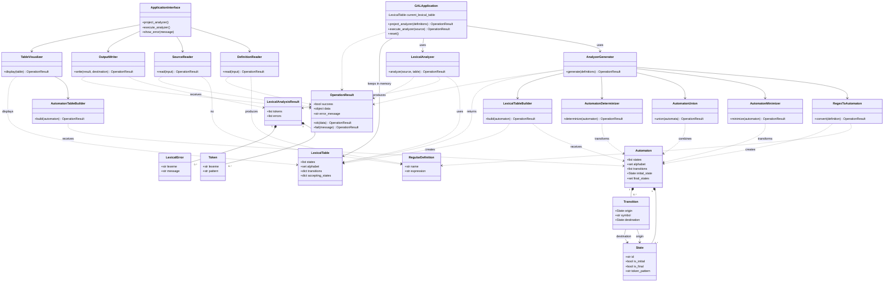

```mermaid
classDiagram
    direction TB

    class RegularDefinition {
        +str name
        +str expression
    }

    class State {
        +str id
        +bool is_initial
        +bool is_final
        +str token_pattern
    }

    class Transition {
        +State origin
        +str symbol
        +State destination
    }

    class Automaton {
        +list states
        +set alphabet
        +list transitions
        +State initial_state
        +set final_states
    }

    class Token {
        +str lexeme
        +str pattern
    }

    class LexicalError {
        +str lexeme
        +str message
    }

    class LexicalTable {
        +list states
        +set alphabet
        +dict transitions
        +dict accepting_states
    }

    class OperationResult {
        +bool success
        +object data
        +str error_message
        +ok(data) OperationResult
        +fail(message) OperationResult
    }

    class LexicalAnalysisResult {
        +list tokens
        +list errors
    }

    class RegexToAutomaton {
        +convert(definition) OperationResult
    }

    class AutomatonMinimizer {
        +minimize(automaton) OperationResult
    }

    class AutomatonUnion {
        +union(automata) OperationResult
    }

    class AutomatonDeterminizer {
        +determinize(automaton) OperationResult
    }

    class LexicalTableBuilder {
        +build(automaton) OperationResult
    }

    class GALApplication {
        -LexicalTable current_lexical_table
        +project_analyzer(definitions) OperationResult
        +execute_analyzer(source) OperationResult
        +reset()
    }

    class AnalyzerGenerator {
        +generate(definitions) OperationResult
    }

    class LexicalAnalyzer {
        +analyze(source, table) OperationResult
    }

    class DefinitionReader {
        +read(input) OperationResult
    }

    class SourceReader {
        +read(input) OperationResult
    }

    class OutputWriter {
        +write(result, destination) OperationResult
    }

    class AutomatonTableBuilder {
        +build(automaton) OperationResult
    }

    class TableVisualizer {
        +display(table) OperationResult
    }

    class ApplicationInterface {
        +project_analyzer()
        +execute_analyzer()
        +show_error(message)
    }

    %% Domain relationships
    Automaton "1" *-- "1..*" State
    Automaton "1" *-- "0..*" Transition
    Transition --> State : origin
    Transition --> State : destination

    LexicalAnalysisResult "1" *-- "0..*" Token
    LexicalAnalysisResult "1" *-- "0..*" LexicalError

    %% Algorithm relationships
    RegexToAutomaton ..> RegularDefinition : receives
    RegexToAutomaton ..> Automaton : creates
    AutomatonMinimizer ..> Automaton : transforms
    AutomatonUnion ..> Automaton : combines
    AutomatonDeterminizer ..> Automaton : transforms
    LexicalTableBuilder ..> Automaton : receives
    LexicalTableBuilder ..> LexicalTable : creates

    %% Project flow
    GALApplication --> AnalyzerGenerator : uses
    AnalyzerGenerator --> RegexToAutomaton
    AnalyzerGenerator --> AutomatonMinimizer
    AnalyzerGenerator --> AutomatonUnion
    AnalyzerGenerator --> AutomatonDeterminizer
    AnalyzerGenerator --> LexicalTableBuilder
    AnalyzerGenerator ..> LexicalTable : returns

    %% Execution flow
    GALApplication --> LexicalAnalyzer : uses
    GALApplication --> LexicalTable : keeps in memory
    LexicalAnalyzer ..> LexicalTable : uses
    LexicalAnalyzer ..> LexicalAnalysisResult : produces

    %% Infrastructure
    ApplicationInterface --> DefinitionReader
    ApplicationInterface --> SourceReader
    ApplicationInterface --> OutputWriter
    ApplicationInterface --> TableVisualizer

    DefinitionReader ..> RegularDefinition : produces
    SourceReader ..> RegularDefinition : no
    OutputWriter ..> LexicalAnalysisResult : receives

    %% Visualization
    AutomatonTableBuilder ..> Automaton : receives
    TableVisualizer --> AutomatonTableBuilder
    TableVisualizer ..> LexicalTable : displays

    %% Result handling
    GALApplication ..> OperationResult
    AnalyzerGenerator ..> OperationResult
    LexicalAnalyzer ..> OperationResult
    DefinitionReader ..> OperationResult
    SourceReader ..> OperationResult
    OutputWriter ..> OperationResult
```