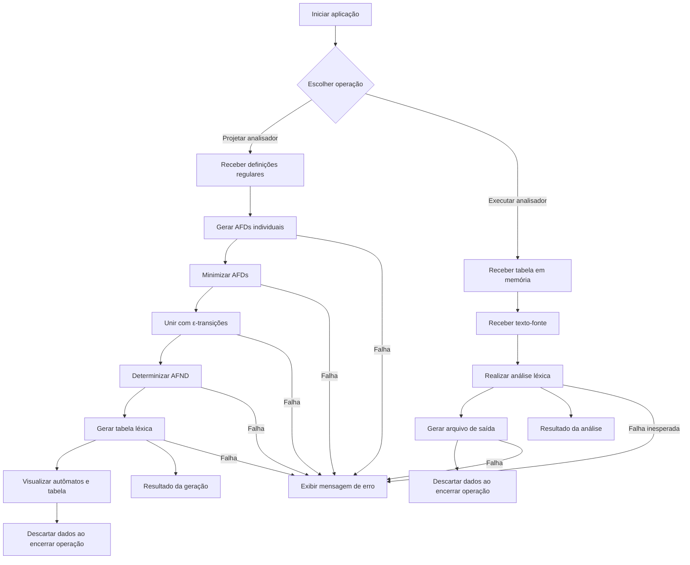

```mermaid
flowchart TD
    A[Iniciar aplicação] --> B{Escolher operação}

    B -->|Projetar analisador| C[Receber definições regulares]
    C --> D[Gerar AFDs individuais]
    D --> E[Minimizar AFDs]
    E --> F[Unir com ε-transições]
    F --> G[Determinizar AFND]
    G --> H[Gerar tabela léxica]
    H --> I[Visualizar autômatos e tabela]
    I --> J[Descartar dados ao encerrar operação]

    B -->|Executar analisador| K[Receber tabela em memória]
    K --> L[Receber texto-fonte]
    L --> M[Realizar análise léxica]
    M --> N[Gerar arquivo de saída]
    N --> O[Descartar dados ao encerrar operação]

    H --> P[Resultado da geração]
    M --> Q[Resultado da análise]

    D -->|Falha| R[Exibir mensagem de erro]
    E -->|Falha| R
    F -->|Falha| R
    G -->|Falha| R
    H -->|Falha| R
    M -->|Falha inesperada| R
    N -->|Falha| R
```